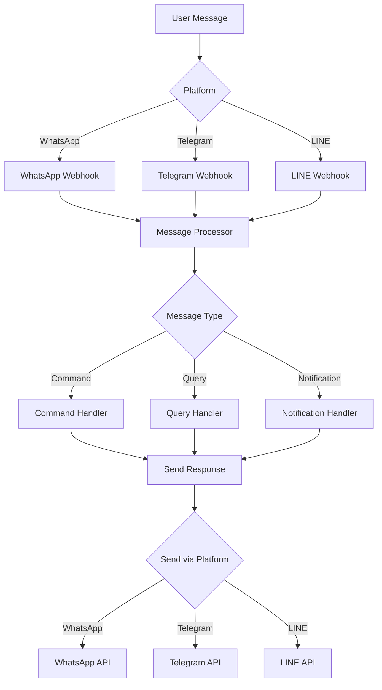

# Panduan Setup Messaging API

## 📱 WhatsApp API

### 1. WhatsApp Business API (Official)
**Cara mendapatkan:**
1. Daftar di [Facebook for Developers](https://developers.facebook.com)
2. Buat App baru, pilih tipe "Business"
3. Tambahkan produk "WhatsApp"
4. Dapatkan:
   - **Phone Number ID**: Di dashboard WhatsApp > Phone numbers
   - **Access Token**: Di dashboard WhatsApp > API Setup
   - **Verify Token**: Buat sendiri untuk webhook verification
   - **Webhook URL**: `https://yourdomain.com/api/webhooks/whatsapp`

### 2. Fonnte
**Cara mendapatkan:**
1. Daftar di [fonnte.com](https://fonnte.com)
2. Login ke dashboard
3. Scan QR dengan WhatsApp
4. Dapatkan:
   - **API Token**: Dashboard > Profile > Token
   - **Device ID**: Dashboard > Device
   - **Webhook URL**: Set di Dashboard > Webhook

### 3. Wablas
**Cara mendapatkan:**
1. Daftar di [wablas.com](https://wablas.com)
2. Beli paket (mulai 99rb/bulan)
3. Login dashboard
4. Dapatkan:
   - **API Token**: Menu API > Token
   - **Domain**: `https://[region].wablas.com`
   - **Device ID**: Menu Device
   - **Webhook URL**: Menu Webhook > Set URL

### 4. WhatsApp Web (Baileys/WA-Multi-Session)
**Cara setup:**
1. Clone repo: `git clone https://github.com/salman0ansari/whatsapp-api-nodejs`
2. Install dependencies: `npm install`
3. Run: `npm start`
4. Scan QR code
5. Dapatkan:
   - **API URL**: `http://localhost:3000` (atau deployed URL)
   - **Session ID**: Generated after QR scan
   - **Webhook URL**: Set in config

## 💬 Telegram Bot API

### Cara mendapatkan Bot Token:
1. Buka Telegram, cari **@BotFather**
2. Kirim `/newbot`
3. Beri nama bot (contoh: "Pondok Imam Syafii Bot")
4. Beri username bot (harus diakhiri `_bot`, contoh: `pondok_syafii_bot`)
5. Dapatkan:
   - **Bot Token**: Format `1234567890:ABCdefGHIjklMNOpqrsTUVwxyz`
   - **Bot Username**: `@pondok_syafii_bot`

### Setup Webhook:
```bash
# Set webhook
curl -F "url=https://yourdomain.com/api/webhooks/telegram" \
     https://api.telegram.org/bot<YOUR_BOT_TOKEN>/setWebhook

# Get webhook info
curl https://api.telegram.org/bot<YOUR_BOT_TOKEN>/getWebhookInfo
```

### Fitur Telegram Bot:
- Kirim pesan text, foto, dokumen
- Inline keyboard & reply keyboard
- Group management
- Channel posting
- Payment integration

## 📲 LINE Messaging API

### Cara mendapatkan:
1. Daftar di [LINE Developers Console](https://developers.line.biz)
2. Create new provider
3. Create new channel (Messaging API)
4. Dapatkan:
   - **Channel ID**: Basic settings
   - **Channel Secret**: Basic settings
   - **Channel Access Token**: Messaging API > Issue
   - **Webhook URL**: `https://yourdomain.com/api/webhooks/line`

### Setup:
1. Di LINE Developers Console:
   - Enable webhook
   - Set Webhook URL
   - Disable "Auto-reply messages"
   - Disable "Greeting messages"
2. Verify webhook
3. Add bot as friend via QR code

### Fitur LINE Bot:
- Rich messages (carousel, buttons, flex)
- Quick reply
- LIFF (LINE Front-end Framework)
- Rich menu
- Broadcast messages

## 🔐 Security Best Practices

### 1. Environment Variables
```env
# WhatsApp Business API
WHATSAPP_PHONE_ID=
WHATSAPP_ACCESS_TOKEN=
WHATSAPP_VERIFY_TOKEN=

# Fonnte
FONNTE_TOKEN=
FONNTE_DEVICE=

# Wablas
WABLAS_TOKEN=
WABLAS_DOMAIN=

# Telegram
TELEGRAM_BOT_TOKEN=
TELEGRAM_WEBHOOK_SECRET=

# LINE
LINE_CHANNEL_ID=
LINE_CHANNEL_SECRET=
LINE_CHANNEL_ACCESS_TOKEN=
```

### 2. Webhook Verification
- **WhatsApp**: Verify token match
- **Telegram**: Check `X-Telegram-Bot-Api-Secret-Token` header
- **LINE**: Verify signature dengan Channel Secret

### 3. Rate Limiting
```typescript
// Example rate limiter
import rateLimit from 'express-rate-limit'

const webhookLimiter = rateLimit({
  windowMs: 1 * 60 * 1000, // 1 minute
  max: 100 // limit each IP to 100 requests per minute
})

app.use('/api/webhooks', webhookLimiter)
```

## 📊 Webhook Payload Examples

### WhatsApp Incoming Message
```json
{
  "entry": [{
    "changes": [{
      "value": {
        "messages": [{
          "from": "6281234567890",
          "text": { "body": "Hello" },
          "type": "text"
        }]
      }
    }]
  }]
}
```

### Telegram Incoming Message
```json
{
  "update_id": 123456789,
  "message": {
    "message_id": 1,
    "from": {
      "id": 123456,
      "first_name": "John"
    },
    "chat": {
      "id": 123456,
      "type": "private"
    },
    "text": "Hello"
  }
}
```

### LINE Incoming Message
```json
{
  "events": [{
    "type": "message",
    "replyToken": "xxx",
    "source": {
      "userId": "U123456",
      "type": "user"
    },
    "message": {
      "type": "text",
      "text": "Hello"
    }
  }]
}
```

## 🚀 Testing Tools

### 1. WhatsApp
- [WhatsApp Business API Postman Collection](https://www.postman.com/meta/workspace/whatsapp-business-platform)

### 2. Telegram
- [Telegram Bot API Tester](https://core.telegram.org/bots/api)

### 3. LINE
- [LINE Bot Designer](https://developers.line.biz/flex-simulator/)
- [Messaging API Tester](https://developers.line.biz/console/)

## 📝 Common Use Cases

### 1. Notifikasi Pembayaran SPP
```typescript
async function sendPaymentReminder(phone: string, studentName: string, amount: number) {
  // WhatsApp
  await sendWhatsAppMessage(phone, 
    `Assalamualaikum Bapak/Ibu,\n\n` +
    `Mengingatkan pembayaran SPP untuk ${studentName}\n` +
    `Jumlah: Rp ${amount.toLocaleString('id-ID')}\n\n` +
    `Terima kasih`
  )
  
  // Telegram (if user has telegram_id)
  await sendTelegramMessage(telegram_id,
    `📚 *Pengingat Pembayaran SPP*\n\n` +
    `Siswa: ${studentName}\n` +
    `Jumlah: Rp ${amount.toLocaleString('id-ID')}\n\n` +
    `Silakan lakukan pembayaran sebelum tanggal 10`
  )
}
```

### 2. Broadcast Pengumuman
```typescript
async function broadcastAnnouncement(title: string, message: string) {
  const users = await getActiveUsers()
  
  for (const user of users) {
    if (user.whatsapp) {
      await sendWhatsAppMessage(user.whatsapp, `📢 ${title}\n\n${message}`)
    }
    if (user.telegram_id) {
      await sendTelegramMessage(user.telegram_id, `📢 *${title}*\n\n${message}`)
    }
    if (user.line_id) {
      await sendLineMessage(user.line_id, `📢 ${title}\n\n${message}`)
    }
  }
}
```

### 3. Absensi Otomatis
```typescript
async function sendAttendanceNotification(studentName: string, status: string, parentPhone: string) {
  const message = status === 'present' 
    ? `✅ ${studentName} telah hadir di sekolah pada pukul ${new Date().toLocaleTimeString('id-ID')}`
    : `⚠️ ${studentName} tidak hadir hari ini. Mohon konfirmasi ke wali kelas`
    
  await sendMultiChannel(parentPhone, message)
}
```

## 🔄 Integration Flow



## 📚 Resources

- [WhatsApp Business Platform](https://developers.facebook.com/docs/whatsapp)
- [Telegram Bot API](https://core.telegram.org/bots/api)
- [LINE Messaging API](https://developers.line.biz/en/docs/messaging-api/)
- [Fonnte Documentation](https://docs.fonnte.com)
- [Wablas Documentation](https://wablas.com/documentation)