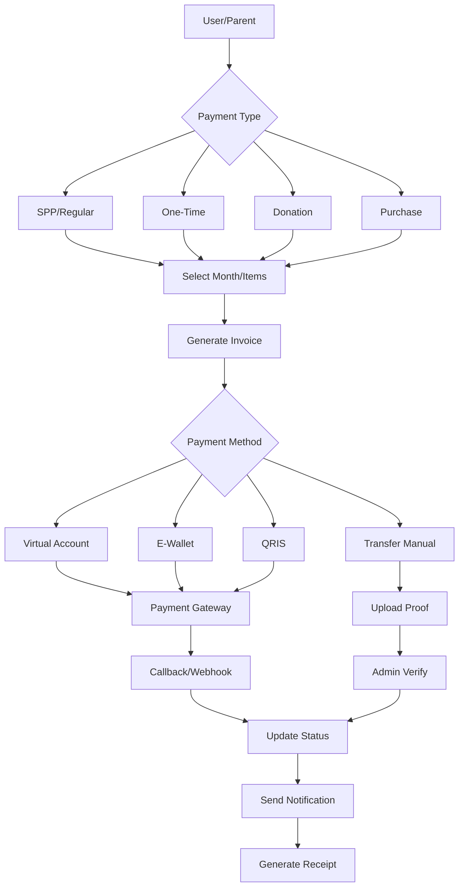

# 💳 PAYMENT SYSTEM DESIGN
## Sistem Pembayaran Terintegrasi - Pondok Imam Syafi'i Blitar

### 🎯 OVERVIEW
Sistem pembayaran all-in-one untuk SPP, donasi, PPDB, unit usaha yayasan dengan multiple payment gateway, auto-billing, dan real-time reporting.

---

## 💰 PAYMENT CATEGORIES

### 1. Regular Payments (SPP & Iuran)
- SPP Bulanan (per jenjang)
- Iuran Asrama
- Iuran Makan
- Iuran Kegiatan
- Iuran Kesehatan

### 2. One-Time Payments
- Pendaftaran (PPDB)
- Daftar Ulang
- Seragam & Buku
- Wisuda/Graduation
- Kartu Siswa

### 3. Donations & Fundraising
- Infaq/Sedekah
- Wakaf
- Zakat
- Campaign khusus
- Qurban & Aqiqah

### 4. Business Unit Transactions
- Koperasi/Toko
- Kantin
- Katering
- Produk UMKM
- Jasa & Layanan

---

## 📊 PAYMENT FLOW



---

## 💾 DATABASE SCHEMA

### 1. Billing & Invoice
```prisma
model Bill {
  id              String   @id @default(cuid())
  billNo          String   @unique // Format: INV/2024/12/0001
  
  // Relations
  studentId       String
  student         Student  @relation(fields: [studentId], references: [id])
  
  // Billing Period
  billType        String   // SPP, REGISTRATION, DONATION, PURCHASE
  billMonth       Int?     // Untuk SPP bulanan
  billYear        Int?
  dueDate         DateTime
  
  // Amount
  subtotal        Decimal
  discount        Decimal  @default(0)
  discountType    String?  // PERCENTAGE, FIXED
  discountReason  String?  // SCHOLARSHIP, SIBLING, EARLY_BIRD
  adminFee        Decimal  @default(0)
  totalAmount     Decimal
  
  // Status
  status          String   @default("UNPAID") // UNPAID, PARTIAL, PAID, OVERDUE, CANCELLED
  paidAmount      Decimal  @default(0)
  remainingAmount Decimal
  
  // Payment Info
  paidAt          DateTime?
  paymentMethod   String?
  
  // Late Payment
  isOverdue       Boolean  @default(false)
  daysOverdue     Int      @default(0)
  lateFee         Decimal  @default(0)
  
  // Items
  items           BillItem[]
  payments        Payment[]
  
  // Metadata
  notes           String?
  createdBy       String?
  createdAt       DateTime @default(now())
  updatedAt       DateTime @updatedAt
}

model BillItem {
  id              String   @id @default(cuid())
  billId          String
  bill            Bill     @relation(fields: [billId], references: [id])
  
  itemName        String   // SPP TK, Iuran Asrama, dll
  itemCode        String   // SPP_TK, ASRAMA_A, dll
  description     String?
  quantity        Int      @default(1)
  unitPrice       Decimal
  amount          Decimal
  
  // Category
  category        String   // TUITION, FACILITY, ACTIVITY, etc
  
  createdAt       DateTime @default(now())
}

model Payment {
  id              String   @id @default(cuid())
  paymentNo       String   @unique // Format: PAY/2024/12/0001
  
  // Relations
  billId          String?
  bill            Bill?    @relation(fields: [billId], references: [id])
  studentId       String?
  student         Student? @relation(fields: [studentId], references: [id])
  
  // Amount
  amount          Decimal
  fee             Decimal  @default(0) // Payment gateway fee
  netAmount       Decimal  // Amount - fee
  
  // Payment Method
  method          String   // VA, EWALLET, QRIS, TRANSFER, CASH
  channel         String?  // BCA, MANDIRI, GOPAY, OVO, etc
  
  // Gateway Info
  gatewayName     String?  // MIDTRANS, XENDIT, MANUAL
  externalId      String?  // ID from payment gateway
  vaNumber        String?  // Virtual account number
  qrCode          String?  // QRIS code URL
  expiredAt       DateTime?
  
  // Status
  status          String   @default("PENDING") // PENDING, SUCCESS, FAILED, EXPIRED, REFUNDED
  
  // Verification (for manual)
  proofUrl        String?  // Bukti transfer
  verifiedBy      String?
  verifiedAt      DateTime?
  
  // Timestamps
  paidAt          DateTime?
  createdAt       DateTime @default(now())
  updatedAt       DateTime @updatedAt
  
  // Callback Data
  callbackData    Json?    // Raw callback from gateway
}

model PaymentMethod {
  id              String   @id @default(cuid())
  
  name            String   // BCA VA, Mandiri VA, GoPay, etc
  code            String   @unique // BCA_VA, MANDIRI_VA, GOPAY
  type            String   // VIRTUAL_ACCOUNT, EWALLET, QRIS, BANK_TRANSFER
  
  // Gateway Config
  gateway         String   // MIDTRANS, XENDIT
  isActive        Boolean  @default(true)
  
  // Fee Configuration
  feeType         String   // PERCENTAGE, FIXED
  feeAmount       Decimal  // 2.5 for percentage, 5000 for fixed
  minFee          Decimal?
  maxFee          Decimal?
  
  // Display
  logo            String?
  instructions    String?  // Payment instructions
  sortOrder       Int      @default(0)
  
  createdAt       DateTime @default(now())
  updatedAt       DateTime @updatedAt
}
```

### 2. Donation Schema
```prisma
model Donation {
  id              String   @id @default(cuid())
  donationNo      String   @unique // Format: DON/2024/12/0001
  
  // Donor Info
  donorName       String
  donorEmail      String?
  donorPhone      String
  donorAddress    String?
  isAnonymous     Boolean  @default(false)
  
  // Donation Details
  type            String   // INFAQ, SEDEKAH, WAKAF, ZAKAT, CAMPAIGN
  campaignId      String?
  campaign        Campaign? @relation(fields: [campaignId], references: [id])
  
  amount          Decimal
  message         String?  // Pesan dari donatur
  
  // Payment
  paymentId       String?
  paymentStatus   String   @default("PENDING")
  paidAt          DateTime?
  
  // Receipt
  receiptNo       String?
  receiptUrl      String?
  
  createdAt       DateTime @default(now())
  updatedAt       DateTime @updatedAt
}

model Campaign {
  id              String   @id @default(cuid())
  
  title           String
  slug            String   @unique
  description     String
  category        String   // PEMBANGUNAN, BEASISWA, KEGIATAN, etc
  
  // Target
  targetAmount    Decimal
  collectedAmount Decimal  @default(0)
  startDate       DateTime
  endDate         DateTime
  
  // Media
  imageUrl        String?
  videoUrl        String?
  
  // Status
  isActive        Boolean  @default(true)
  isFeatured      Boolean  @default(false)
  
  // Updates
  updates         CampaignUpdate[]
  donations       Donation[]
  
  createdAt       DateTime @default(now())
  updatedAt       DateTime @updatedAt
}
```

---

## 🏪 UNIT USAHA INTEGRATION

### POS System Schema
```prisma
model Product {
  id              String   @id @default(cuid())
  
  name            String
  sku             String   @unique
  barcode         String?
  category        String   // MAKANAN, MINUMAN, ATK, SERAGAM, etc
  
  // Pricing
  costPrice       Decimal  // Harga modal
  sellPrice       Decimal  // Harga jual
  memberPrice     Decimal? // Harga khusus member
  
  // Stock
  stock           Int      @default(0)
  minStock        Int      @default(10)
  unit            String   // PCS, PACK, BOX, etc
  
  // Info
  description     String?
  imageUrl        String?
  isActive        Boolean  @default(true)
  
  createdAt       DateTime @default(now())
  updatedAt       DateTime @updatedAt
}

model Transaction {
  id              String   @id @default(cuid())
  transactionNo   String   @unique // Format: TRX/2024/12/0001
  
  // Customer
  customerId      String?  // Could be student, parent, or public
  customerName    String
  customerType    String   // STUDENT, PARENT, STAFF, PUBLIC
  
  // Items
  items           TransactionItem[]
  
  // Amount
  subtotal        Decimal
  discount        Decimal  @default(0)
  tax             Decimal  @default(0)
  totalAmount     Decimal
  
  // Payment
  paymentMethod   String   // CASH, TRANSFER, QRIS, TEMPO
  paymentStatus   String   @default("PAID") // PAID, PENDING (for tempo)
  paidAmount      Decimal
  change          Decimal  @default(0)
  
  // Due Date (for tempo)
  dueDate         DateTime?
  
  // Cashier
  cashierId       String
  shiftId         String?
  
  createdAt       DateTime @default(now())
  updatedAt       DateTime @updatedAt
}
```

---

## 🔧 API ENDPOINTS

### Billing APIs
```typescript
// Billing Management
GET    /api/billing/student/:id     - Get student bills
POST   /api/billing/generate        - Generate monthly bills
POST   /api/billing/generate-single - Generate single bill
PUT    /api/billing/:id             - Update bill
DELETE /api/billing/:id             - Cancel bill

// Bulk Operations
POST   /api/billing/bulk-generate   - Generate for all students
POST   /api/billing/bulk-reminder   - Send payment reminders
```

### Payment APIs
```typescript
// Payment Processing
POST   /api/payment/create          - Create payment/VA
POST   /api/payment/check/:id       - Check payment status
POST   /api/payment/callback        - Gateway webhook
POST   /api/payment/notification    - Gateway notification

// Manual Payment
POST   /api/payment/manual          - Submit manual payment
POST   /api/payment/verify/:id      - Verify manual payment
```

### Donation APIs
```typescript
// Donation
POST   /api/donation/create         - Create donation
GET    /api/donation/campaigns      - List campaigns
GET    /api/donation/campaign/:slug - Campaign details
POST   /api/donation/anonymous      - Anonymous donation
```

### POS APIs
```typescript
// Products
GET    /api/pos/products           - List products
POST   /api/pos/product            - Add product
PUT    /api/pos/product/:id        - Update product
POST   /api/pos/stock              - Update stock

// Transaction
POST   /api/pos/transaction        - Create transaction
GET    /api/pos/transaction/:id    - Get transaction
POST   /api/pos/transaction/void   - Void transaction
```

---

## 💳 PAYMENT GATEWAY INTEGRATION

### 1. Midtrans Configuration
```javascript
// config/midtrans.js
const midtransClient = require('midtrans-client');

const snap = new midtransClient.Snap({
  isProduction: process.env.NODE_ENV === 'production',
  serverKey: process.env.MIDTRANS_SERVER_KEY,
  clientKey: process.env.MIDTRANS_CLIENT_KEY
});

// Create Transaction
const parameter = {
  transaction_details: {
    order_id: billNo,
    gross_amount: amount
  },
  customer_details: {
    first_name: studentName,
    email: email,
    phone: phone
  },
  enabled_payments: ['bank_transfer', 'gopay', 'shopeepay'],
  callbacks: {
    finish: `${baseUrl}/payment/success`,
    error: `${baseUrl}/payment/error`,
    pending: `${baseUrl}/payment/pending`
  }
};
```

### 2. Xendit Configuration
```javascript
// config/xendit.js
const Xendit = require('xendit-node');
const x = new Xendit({
  secretKey: process.env.XENDIT_SECRET_KEY,
});

// Create Virtual Account
const va = await x.VirtualAcc.create({
  externalID: paymentId,
  bankCode: 'BCA',
  name: studentName,
  expectedAmount: amount,
  expirationDate: new Date(Date.now() + 24*60*60*1000),
  isClosed: true,
  isReusable: false
});
```

---

## 📱 PAYMENT UI/UX

### Payment Page Components
1. **Bill Summary Card**
   - Student info
   - Bill items with breakdown
   - Total amount
   - Due date countdown

2. **Payment Method Selector**
   - Grouped by type (VA, E-Wallet, QRIS)
   - Show fees transparently
   - Estimated arrival time

3. **Payment Instructions**
   - Step-by-step guide
   - Copy VA number button
   - QR code display for QRIS
   - Screenshot instructions

4. **Payment Status Tracker**
   ```
   [✓] Invoice Created -> [✓] Payment Initiated -> [⏳] Waiting Payment -> [ ] Payment Success
   ```

---

## 📊 FINANCIAL REPORTS

### Daily Reports
1. Total transactions
2. Payment method breakdown
3. Outstanding bills
4. Collection rate

### Monthly Reports
1. SPP collection rate
2. Overdue analysis
3. Discount summary
4. Revenue breakdown

### Custom Reports
1. Per-student payment history
2. Per-class collection status
3. Donation reports
4. Unit usaha profit/loss

### Export Options
- Excel (.xlsx)
- PDF with letterhead
- CSV for accounting software
- API for integration

---

## 🔔 NOTIFICATION SYSTEM

### Automated Reminders
```javascript
// 7 days before due date
"Yth. Bapak/Ibu, tagihan SPP {student} bulan {month} sebesar {amount} jatuh tempo {date}"

// On due date
"Hari ini jatuh tempo pembayaran SPP {student}. Silakan lakukan pembayaran."

// 3 days overdue
"Tagihan SPP {student} telah melewati jatuh tempo. Mohon segera dilakukan pembayaran."
```

### Payment Confirmations
```javascript
// Success
"Pembayaran SPP {student} bulan {month} sebesar {amount} telah kami terima. Terima kasih."

// Receipt
"Kwitansi pembayaran dapat diunduh di: {receipt_url}"
```

---

## 🔒 SECURITY MEASURES

### Payment Security
1. **Tokenization** - Never store card details
2. **SSL/TLS** - Encrypted connections
3. **Webhook Validation** - Verify gateway callbacks
4. **Rate Limiting** - Prevent abuse
5. **Audit Trail** - Log all transactions

### Fraud Prevention
1. Duplicate payment check
2. Amount validation
3. Velocity checks
4. Manual review for large amounts
5. IP-based restrictions

---

## 📈 ANALYTICS & INSIGHTS

### Key Metrics
1. **Collection Rate**: Target > 95%
2. **On-time Payment**: Target > 80%
3. **Payment Method Usage**: Track trends
4. **Average Days to Pay**: < 7 days
5. **Failed Payment Rate**: < 5%

### Predictive Analytics
1. Late payment prediction
2. Churn risk (dropout)
3. Optimal reminder timing
4. Discount effectiveness

---

## 🚀 IMPLEMENTATION ROADMAP

### Phase 1: Core Billing (Week 1-2)
- Student billing system
- Invoice generation
- Basic payment tracking

### Phase 2: Payment Gateway (Week 3-4)
- Midtrans integration
- Virtual Account
- E-Wallet & QRIS

### Phase 3: Automation (Week 5-6)
- Auto-billing
- Payment reminders
- Receipt generation

### Phase 4: Advanced Features (Week 7-8)
- Donation portal
- POS system
- Financial reports

---

## 🛠️ TECH STACK

### Backend
- Node.js + Express
- Prisma ORM
- PostgreSQL
- Redis (for caching)
- Bull (job queues)

### Payment Gateways
- Midtrans
- Xendit
- Manual verification system

### Notifications
- WhatsApp Business API
- SendGrid (email)
- FCM (push notifications)

### Reporting
- ExcelJS
- PDFKit
- Chart.js
- React-PDF

---

**Version**: 1.0.0
**Last Updated**: December 2024
**Status**: Ready for Development