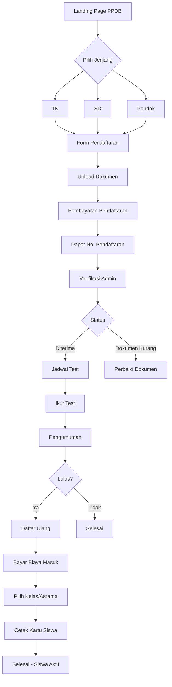

# 📚 PPDB ONLINE SYSTEM DESIGN
## Penerimaan Peserta Didik Baru - Pondok Imam Syafi'i Blitar

### 🎯 OVERVIEW
Sistem pendaftaran online untuk calon santri/siswa baru TK, SD, dan Pondok dengan tracking status real-time, pembayaran terintegrasi, dan administrasi otomatis.

---

## 📊 USER FLOW



---

## 💾 DATABASE SCHEMA

### 1. Registration Table
```prisma
model Registration {
  id                String   @id @default(cuid())
  registrationNo    String   @unique // Format: PPDB-2024-001
  
  // Personal Data
  fullName          String
  nickname          String?
  gender            String   // L/P
  birthPlace        String
  birthDate         DateTime
  nik               String?
  nisn              String?
  
  // Address
  address           String
  rt                String?
  rw                String?
  village           String
  district          String
  city              String
  province          String
  postalCode        String?
  
  // Education
  level             String   // TK, SD, PONDOK
  previousSchool    String?
  gradeTarget       String?  // Kelas yang dituju
  programType       String?  // REGULER, TAHFIDZ, KITAB
  boardingType      String?  // MONDOK, PULANG
  
  // Parent Data
  fatherName        String
  fatherNik         String?
  fatherJob         String?
  fatherPhone       String?
  fatherEducation   String?
  motherName        String
  motherNik         String?
  motherJob         String?
  motherPhone       String?
  motherEducation   String?
  
  // Guardian (if different)
  guardianName      String?
  guardianRelation  String?
  guardianPhone     String?
  guardianAddress   String?
  
  // Contact
  phoneNumber       String
  whatsapp          String
  email             String?
  
  // Status Tracking
  status            String   @default("DRAFT") // DRAFT, SUBMITTED, VERIFIED, TEST, PASSED, FAILED, REGISTERED
  paymentStatus     String   @default("UNPAID") // UNPAID, PAID, VERIFIED
  
  // Documents
  documents         Document[]
  
  // Test & Selection
  testSchedule      DateTime?
  testVenue         String?
  testScore         Json?    // {quran: 80, arabic: 75, interview: 85}
  testResult        String?  // PASSED, FAILED, WAITING
  ranking           Int?
  
  // Registration Fee
  registrationFee   Decimal  @default(150000)
  paymentMethod     String?
  paymentDate       DateTime?
  paymentProof      String?
  
  // Re-registration (Daftar Ulang)
  reregStatus       String?  // WAITING, COMPLETED
  reregDate         DateTime?
  
  // Admin Notes
  notes             String?
  verifiedBy        String?
  verifiedAt        DateTime?
  
  // Timestamps
  createdAt         DateTime @default(now())
  updatedAt         DateTime @updatedAt
  
  // Relations
  payments          Payment[]
  student           Student?
}

model Document {
  id               String   @id @default(cuid())
  registrationId   String
  registration     Registration @relation(fields: [registrationId], references: [id])
  
  documentType     String   // AKTA, KK, FOTO, IJAZAH, RAPORT, KIP, etc
  fileName         String
  fileUrl          String
  fileSize         Int
  uploadedAt       DateTime @default(now())
  
  status           String   @default("PENDING") // PENDING, APPROVED, REJECTED
  verifiedBy       String?
  verifiedAt       DateTime?
  notes            String?
}
```

### 2. Test Management
```prisma
model TestSchedule {
  id              String   @id @default(cuid())
  
  level           String   // TK, SD, PONDOK
  batchName       String   // Gelombang 1, 2, dst
  testDate        DateTime
  testTime        String   // 08:00 - 12:00
  venue           String
  capacity        Int
  registered      Int      @default(0)
  
  // Test Components
  hasQuranTest    Boolean  @default(true)
  hasArabicTest   Boolean  @default(false)
  hasAcademicTest Boolean  @default(true)
  hasInterview    Boolean  @default(true)
  
  status          String   @default("OPEN") // OPEN, CLOSED, COMPLETED
  
  createdAt       DateTime @default(now())
  updatedAt       DateTime @updatedAt
}
```

---

## 🖥️ FRONTEND PAGES

### 1. Public Pages
- `/ppdb` - Landing page dengan info pendaftaran
- `/ppdb/register` - Form pendaftaran
- `/ppdb/status` - Cek status pendaftaran
- `/ppdb/announcement` - Pengumuman kelulusan
- `/ppdb/guide` - Panduan pendaftaran

### 2. Applicant Dashboard
- `/ppdb/dashboard` - Overview status
- `/ppdb/documents` - Upload/manage dokumen
- `/ppdb/payment` - Pembayaran & konfirmasi
- `/ppdb/test` - Info jadwal test
- `/ppdb/result` - Hasil test

### 3. Admin Pages
- `/admin/ppdb` - List pendaftar
- `/admin/ppdb/verify` - Verifikasi dokumen
- `/admin/ppdb/test` - Manage jadwal test
- `/admin/ppdb/scoring` - Input nilai test
- `/admin/ppdb/selection` - Seleksi & ranking
- `/admin/ppdb/reports` - Laporan PPDB

---

## 🔧 API ENDPOINTS

### Registration
```typescript
POST   /api/ppdb/register     - Submit pendaftaran
GET    /api/ppdb/status/:id   - Check status
PUT    /api/ppdb/update/:id   - Update data
POST   /api/ppdb/documents    - Upload dokumen
DELETE /api/ppdb/document/:id - Hapus dokumen
```

### Payment
```typescript
POST   /api/ppdb/payment/initiate  - Create payment
POST   /api/ppdb/payment/confirm   - Konfirmasi manual
POST   /api/ppdb/payment/callback  - Payment gateway callback
GET    /api/ppdb/payment/status    - Check payment status
```

### Test Management
```typescript
GET    /api/ppdb/test/schedule     - Jadwal test
POST   /api/ppdb/test/register     - Daftar test
POST   /api/ppdb/test/score        - Input nilai
GET    /api/ppdb/test/result       - Hasil test
```

### Selection
```typescript
GET    /api/ppdb/selection/ranking  - Ranking pendaftar
POST   /api/ppdb/selection/announce - Umumkan hasil
GET    /api/ppdb/selection/stats    - Statistik
```

---

## 💳 PAYMENT INTEGRATION

### Payment Flow
1. **Registration Fee** (Biaya Pendaftaran)
   - Fixed: Rp 150,000
   - Via: VA, E-Wallet, QRIS

2. **Entrance Fee** (Biaya Masuk - setelah lulus)
   - TK: Rp 3,000,000
   - SD: Rp 5,000,000
   - Pondok: Rp 8,000,000
   - Include: Seragam, Buku, dll

3. **Payment Methods**
   - Virtual Account (BCA, Mandiri, BNI, BRI)
   - E-Wallet (GoPay, OVO, Dana)
   - QRIS
   - Transfer Manual + Konfirmasi

---

## 📧 NOTIFICATION SYSTEM

### Email Notifications
1. Registration submitted
2. Payment confirmed
3. Document verified
4. Test schedule
5. Test result
6. Final acceptance

### WhatsApp Notifications
```javascript
// Template Messages
1. "Terima kasih telah mendaftar. No pendaftaran Anda: {reg_no}"
2. "Pembayaran berhasil. Silakan lengkapi dokumen."
3. "Selamat! Anda diterima di {level}. Silakan daftar ulang."
```

---

## 🎨 UI COMPONENTS

### Registration Form
- Multi-step wizard
- Auto-save draft
- Field validation
- Document preview
- Progress indicator

### Status Tracker
```
[✓] Pendaftaran -> [✓] Pembayaran -> [✓] Verifikasi -> [ ] Test -> [ ] Pengumuman
```

### Document Upload
- Drag & drop
- Multiple files
- Image compression
- PDF support
- Preview before upload

---

## 📊 REPORTS & ANALYTICS

### Admin Dashboard
1. Total pendaftar per jenjang
2. Conversion rate
3. Payment status
4. Document verification progress
5. Test participation rate
6. Acceptance rate

### Exportable Reports
- List pendaftar (Excel/PDF)
- Payment report
- Test scores
- Final selection list
- Statistics per region

---

## 🔒 SECURITY & VALIDATION

### Data Validation
- NIK validation (16 digits)
- NISN validation (10 digits)
- Phone number format
- Email verification
- Duplicate check

### Access Control
- Public: Registration, status check
- Applicant: Own data only
- Admin: Full access
- Super Admin: Settings & config

---

## 📱 MOBILE RESPONSIVE

### Features
- Mobile-first design
- Touch-friendly forms
- Camera integration for documents
- Offline capability (save draft)
- Push notifications

---

## 🚀 IMPLEMENTATION PHASES

### Phase 1: Core Registration (Week 1)
- Registration form
- Document upload
- Basic status tracking

### Phase 2: Payment Integration (Week 2)
- Payment gateway
- Payment confirmation
- Invoice generation

### Phase 3: Test Management (Week 3)
- Test scheduling
- Score input
- Result announcement

### Phase 4: Analytics & Reports (Week 4)
- Dashboard
- Reports
- Export functionality

---

## 🛠️ TECH REQUIREMENTS

### Frontend
- Next.js 14
- React Hook Form
- Zod validation
- TanStack Query
- Tailwind CSS

### Backend
- Prisma ORM
- PostgreSQL
- NextAuth
- Multer/Cloudinary
- Node Mailer

### Payment
- Midtrans/Xendit SDK
- Virtual Account
- E-Wallet API
- QRIS Generator

### Notifications
- WhatsApp Business API
- SendGrid/Resend
- Push Notifications (PWA)

---

## 📈 SUCCESS METRICS

1. **Registration Completion Rate**: > 80%
2. **Payment Success Rate**: > 95%
3. **Document Verification Time**: < 24 hours
4. **User Satisfaction**: > 4.5/5
5. **System Uptime**: > 99.9%

---

**Version**: 1.0.0
**Last Updated**: December 2024
**Status**: Ready for Development